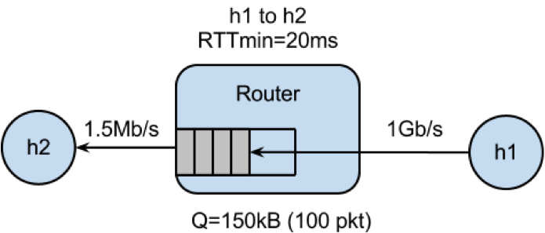

# EE449 Congestion Control and Bufferbloat Lab

This lab is intended to demonstrate transport layer phenomena surrounding different TCP congestion control algorithms as well as the bufferbloat problem that we've discussed in class. 

## Congestion Control

This section of the lab demonstrates different congestion control algorithms in action.

The dumbbell network topology looks like this:

          s1------s2    s1 & s2 are backbone routers 1 & 2
           |       |
          s3      s4    s3 and s4 are access routers 1 & 2
          /\      /\
        h1  h3  h2  h4  h1 & h3 are source hosts 1 & 2, and h2 & h4 are receiver hosts 1 & 2

The experiment script is set up to run multiple times, each time varying the latency between the backbone routers. The hosts use iperf to send traffic to each other using TCP flows and the script collects congestion window

For the first run, use TCP Reno and configure iperf to run for 100 seconds, with a second iperf flow starting 10 seconds later, as in this command:
```
sudo python ./tcp_cc_dumbbell_topo.py -i 100 -j 10 -a reno
```
Once the experiment is complete you should have multiple png plots showing the flow performance with different latencies.

Now run the script with CUBIC - a common CC algorithm.
```
sudo python ./tcp_cc_dumbbell_topo.py -i 100 -j 10 -a cubic
```

Compare the CUBIC outputs to the Reno outputs. What is different? Why? How does latency impact the sawtooth behavior?

Next, run the experiment with Vegas, an RTT-based congestion control algorithm rather than a loss-based CC.
```
sudo python ./tcp_cc_dumbbell_topo.py -i 100 -j 10 -a vegas
```

### Mixing CC
The previous experiments used the same congestion control algorithms for both flows. Next let's look at what happens when you mix them. The tcp_cc_vs_reno.py script sets the second iperf flow to use Reno automatically. Run it while specifying the other CC algo to use:
```
sudo python ./tcp_cc_vs_reno.py -i 100 -j 10 -a vegas
```

and CUBIC
```
sudo python ./tcp_cc_vs_reno.py -i 100 -j 10 -a cubic
```

Now look at the congestion window and fairness results. What do you see? How does latency affect the mixture?

## Bufferbloat

This section of the lab illustrates bufferbloat - the problem that arises when routers have large queues. The problem stems from TCP behavior being based on loss rather than RTT. The network looks like the following figure, with a bottleneck link of 1.5Mbps compared to an initial link between the sending host to the router of 1Gbps.




The experiment is set to send traffic between h1 and h2 and you can vary the size of the queue on the router. What the code does:
- Start a long lived TCP flow sending data from h1 to h2. Use iperf/iperf3.
- Start back-to-back ping train from h1 to h2 10 times a second and record the RTTs.
- Plot the time series of the following:
    - The RTT reported by ping
    - Queue size at the bottleneck

Make sure you are in the bb directory:
```
cd bb
```

The file you will edit is run.sh. The parameter to edit is the queue size on line 13.

Run the simulation using the default parameter (qsize of 10):
```
sudo ./run.sh
```

Check out the webserver performance results in web_result.txt. This file tracks repeated download performance over this network.

Now run the experiment with a larger queue size. Change run.sh to have a queue of 500 segments and run.

Compare the output images of the two experiments. Pay attention to the queue occupancy plot and the corresponding RTTs during the times when the queue is full or nearly full. Also check out the web server performance. What are your takeaways?

Note that mininet can be somewhat flakey and it can sometimes help to exit it between each run. To do so, enter mininet and type exit.
```
sudo mn

exit
```
